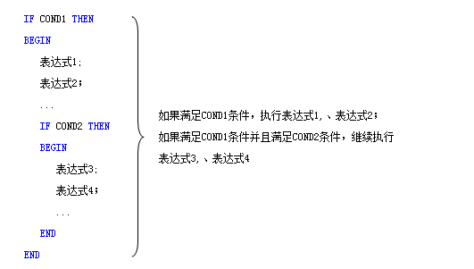

## 操作符


| 操作符 | 意义 | 举例 |
| ------ | ------ | ------ |
|`+` |加法|`CLOSE＋OPEN;` 返回收盘价与开盘价的和。|
|`-`|减法|`CLOSE－OPEN;` 返回收盘价与开盘价的差。|
| `*` |乘法|`CLOSE*OPEN;` 返回收盘价与开盘价的积。|
|`/`|除法|`CLOSE/OPEN;` 返回收盘价与开盘价的商。|
|`&&`|与（并且），也可简写为 AND|`CLOSE>OPEN && REF(CLOSE>OPEN,1);` 当根 k 线与前一根 k 线都收阳返回 1，否则返回 0。|
|<code>&#124;&#124;</code>|或（或者），也可简写为 OR|<code>CLOSE>OPEN &#124;&#124; REF(CLOSE>OPEN,1);</code>当根 k 线收阳或前一根 k 线收阳返回 1，否则返回 0。|
|`>`|大于|`CLOSE>OPEN;` 当根 k 线的收盘价大于开盘价（阳线）返回 1，否则返回 0。|
|`<`|小于|`CLOSE<OPEN;` 当根 k 线的收盘价小于开盘价（阴线）返回 1，否则返回 0。|
|`>=`|大于等于|`CLOSE>=2000;` 当根 k 线收盘价大于等于 2000 返回 1，否则返回 0。|
|`<=`|小于等于|`CLOSE<=2000;` 当根 k 线收盘价小于等于 2000 返回 1，否则返回 0。|
|`<>`|不等于|`DATE<>REF(DATE,1);` 当根 k 线的日期与前一根 k 线的日期不等（当根 k 线为当日第一根 k 线）返回 1，否则返回 0。|
|`=`|等于操作符|`TIME=1459;` 当根 k 线的时间为 14 点 59 分返回 1，否则返回 0。|
|`:=`|定义变量（模型加载时不显示线）|`AA:=(OPEN+CLOSE)/2;`定义变量 AA，模型加载时 AA 在图表上不显示线。|
|`:`|定义变量（模型加载时显示线）|`AA:(OPEN+CLOSE)/2;`定义变量 AA，模型加载时 AA 在图表上显示线。|
|`^^`|定义变量（以主图附加坐标方式显示）|`AA^^(OPEN+CLOSE)/2;`// 定义变量 AA，主图加载时，无论指标属性如何，AA 都以主图附加坐标方式在主图显示。|
|`..`|定义变量（以独立坐标方式显示）|`AA..(OPEN+CLOSE)/2;`// 定义变量 AA，主图加载时，无论指标属性如何，AA 以独立坐标方式在主图显示。|


## 语法


编辑平台的语法	

### 1、编写规则

1. 请使用半角输入，不区分大小写；
2. 每一行语句以 `";"` 结束；
3. 注释行前用 `“//”` 标识；

### 2、变量命名

`“O”` `“H”` `“L”` `“C”` 为系统关键字，不可以用作变量名。

### 3、交易指令冲突

过滤模型不支持指令里定义手数，例如：BK(5)。

### 4、函数冲突

（1）`TRADE_OTHER`的基础数据是一分钟数据，与`CHECKSIG_MIN`、`MULTSIG_MIN`配套，但是不能与`CHECKSIG`、`MULTSIG` 函数一起使用。

（2）`CLOSEKLINE`/`CLOSEKLINE_MIN`只支持收盘价模型，不能再写`CHECKSIG`/`CHECKSIG_MIN`函数、`MULTSIG`/`MULTSIG_MIN` 函数。

（3）`CLOSEKLINE`和`CLOSEKLINE_MIN` 函数有冲突，不能一起使用。

（4）`CHECKSIG`/`CHECKSIG_MIN`这类函数，`MULTSIG`/`MULTSIG_MIN` 这类函数，二类函数是有冲突的，不能一起使用。

（5）`CHECKSIG`和`CHECKSIG_MIN` 函数有冲突，不能一起使用。

（6）`MULTSIG`和`MULTSIG_MIN` 函数有冲突，不能一起使用。

（7）`MULTSIG`/`MULTSIG_MIN`表示一根 k 线多信号，和表示一根 k 线一个信号但是不同 k 线指令行重复生效的`TRADE_AGAIN` 函数有冲突，不能一起使用。

（8）`CLOSEMINUTE/CLOSESEC` 只支持收盘价模型，不能再写 `CHECK_MIN/CHECKSIG`、`MULTSIG_MIN/MULTSIG` 函数。

（9）`CLOSEMINUTE1/CLOSESEC1` 只支持指令价模型，不能与 `CLOSEKLINE/CLOSEKLINE_MIN` 一起使用。

### 5、IF ... THEN BEGIN ... END 语法



### 6、定义全局变量
```
    VARIABLE:VAR1:=X,VAR2:=Y;
    IF 条件 1 THEN
VAR1:=VAR1+1;
    IF 条件 2 THEN
VAR2:=VAR2+1;

    VARIABLE 表示声明后面的变量名为全局变量
    VAR1 VAR2 全局变量的名字
    X Y 为全局变量的初始值
    VAR1:=VAR1+1; 表示给 VARI 赋值
```
如果当前 K 线条件满足条件 1，则给 VARI 赋值为 VAR1+1，**否则仍旧取值为之前的 VAR1 的值**
